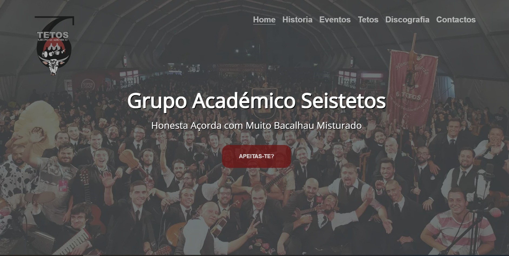

# Overview

A Website I built for Grupo Académico Seistetos. This was my first website and the one where I consolidated my HTML, CSS and Javascript skills. I later rebuilt this using Vue3 as a SPA which enabled me to produce a much more readable and mantainable codebase

### Links

- Live Site URL: [Seistetos](https://seistetos.uevora.pt)

### Built with

- Semantic HTML5 markup
- CSS custom properties
- Flexbox
- [Vue3](https://v3.vuejs.org/) - JS library
- [SASS](https://sass-lang.com/) - CSS extension

## Author

- Website - [Tiago Costa](https://www.tiagocostadev.com/#/)

## Acknowledgments

A special thanks to Mirti for having the patience of hearing me rambling about all the silly bugs I found during the development of my this project and to all the group members who sent me their picture and information, definetly helped on giving the members page a bit more life.
